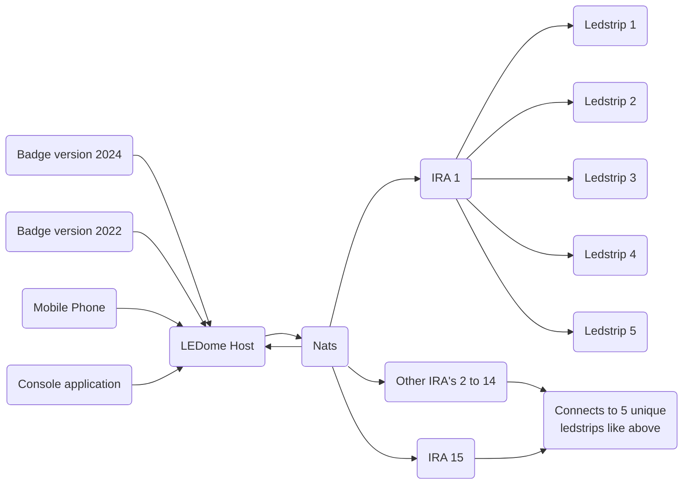

# LEDome
LEDome is een host application that renders gameplay for on a dome powered and visualized by leds.

We need 4 things to get this to work.

- Clients = 1 player (this can be badge controller, mobile phone, ...) that will send instructions.
- LedDome Host that can receive all client input. (process the input to output with game logic)
- The Nats server to send all the output distribution mechanism.
- 15 pieces IRA boards (each a part on the dome) that will send the color output to the led. (5 led strips on each Ira board.)

The advantage of this is that all knowledge is centralized for the game to play.

We can easy switch the game from snake to something else. :-)

​	

10% version of the dome

