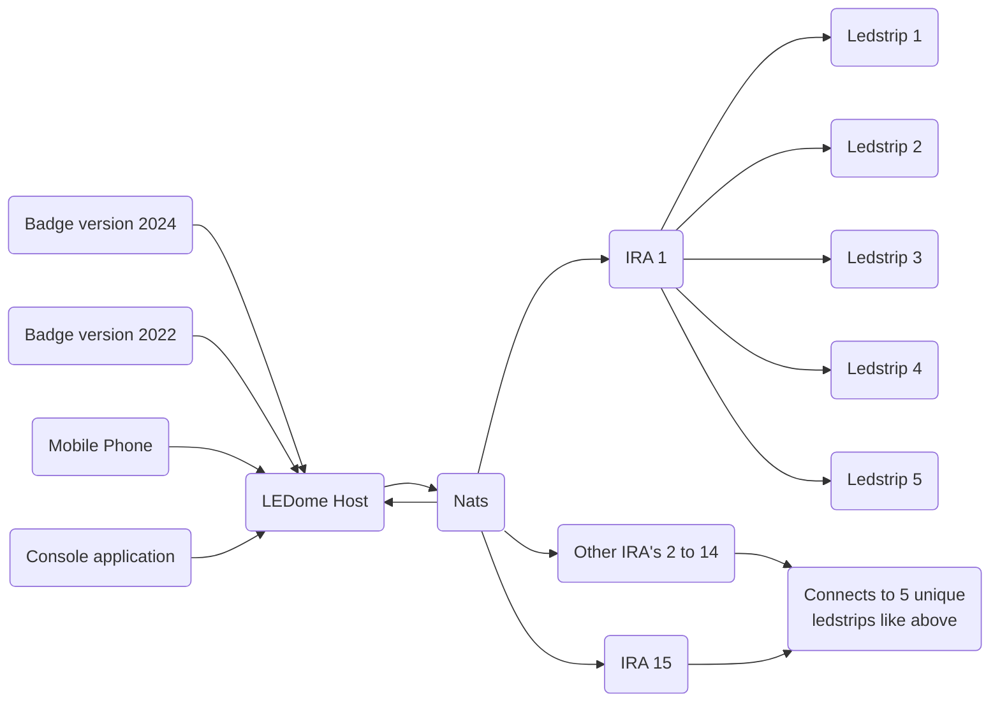

# LEDome
LEDome is een host application that renders gameplay for on a dome powered and visualized by leds.

We need 4 things to get this to work.

- Clients = 1 player (this can be badge controller, mobile phone, ...) that will send instructions.
- LedDome Host that can receive all client input. (process the input to output with game logic)
- The Nats server to send all the output distribution mechanism.
- 15 pieces IRA boards (each a part on the dome) that will send the color output to the led. (5 led strips on each Ira board.)
  The IRA can do more things but for now we keep it like this.

The advantage of this is that all knowledge is centralized for the game to play.

We can easy switch the game from "Snake" to something else. :-)

This is the 10% version of the dome

**Important info!**
The "*Small*" dome version vs "*Real*" version will have a difference in length strips. This will not change the logic, it's only display purpose.

Er zijn 3 kleuren = 3 verschillende lengtes.

<u>Spelregels & knowledge base for snake</u> 
reference: 

- We starten met een basislengte van 5 leds. (elk patroon moet unique zijn!) Eventueel het patroon op de badge tonen. 
  Het kleur patroon kan niet de kleur zijn van de breadcrumbs.
- We bewegen enklel voorwaarts en kunnen enkel links of rechts.
- Komen 2 snakes elkaar tegen kop aan kop -> spelen we blad steen schaar. -> de verliezer start opnieuw op en de winnaar krijgt de lengte van zijn snake.
- De snakes kunnen langer worden door de breadcrumbs te eten die enkel zichtbaar zijn op de dome.
- Komen we onderaan aan de voet van de dome dan keren we van richting als we beneden zijn)
- We hebben een vaste snelheid -> maar we kunnen die optrekken.
- Je kan je eigen bijten = game over.
- We beginnen ergens onderaan (gele zone). (we blinken of knipper modes  = init mode en je kan jezelf zoeken op de dome.)
  Bij eerste button press -> bevestig je en je bent vertrokken.
- Bij elk kruispunt stoppen we en zeggen we welke richting we uitgaan.
- Bij niet reageren tijdens bladsteen schaar -> wint de 1e degene die reactie geeft. (Geen reactie van beide binnen 5 seconden = Game over)
- Bekijken waar we onze beperking gaan opleggen. (De slanger worden steeds groter = voordeel voor de grotere, en is geen fun voor de andere)
- Geen reactie binnen de 20 seconden aan een kruispunt = game over.
- Maximale lengte instellen van een snake? (en de score ergens weergeven. (display badge?))

We gaan een versie nummer moeten bijhouden. (indien aanpassingen aan de badge. -> dat we weten welke versie welke data gaat insturen)
Op die manier kunnen we firmware update afdwingen. (indien nodig)

We moeten een score kunnen opvragen. -> dit weer geven op de badge. -> via NATS
Als we die logica uitschrijven ...

Als spelers willen meespelen -> unique naam? (badge?)

Score in welke mate bijhouden?

Patroon bij houden?

Patroon aanpassen?

